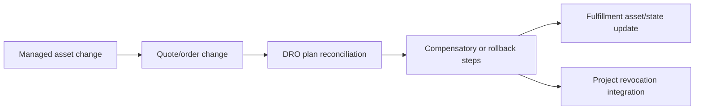

## Purpose

Current project scope remains new orders only. Salesforce supports asset amendments, renewals, cancellations, swaps, transfers, future transactions, and rollback; DRO also documents plan reconciliation, compensatory steps, rollback steps, PONR, and supplemental actions ([asset lifecycle](https://help.salesforce.com/s/articleView?id=ind.qocal_manage_assets_in_revenue_lifecycle_management.htm&language=en_US&type=5), [DRO essentials](https://help.salesforce.com/s/articleView?id=ind.dynamic_revenue_orchestration_essentials.htm&language=en_US&type=5)).

## When to use this doc (agent trigger conditions)

- “Amend/renew/cancel an asset.”
- “Revoke access after contract change.”
- “Reconcile an in-flight order.”
- “What happens after PONR?”

## Key concepts

- **Asset state period:** effective configuration over time.
- **Plan reconciliation:** regenerates affected fulfillment after in-flight change.
- **Compensatory / rollback steps:** replace amended/canceled steps.
- **PONR:** restricts amendment/cancellation after a configured point.
- **Rule Enforcement:** mapping can target All Fulfillment Requests or Initial Fulfillment Request.

## Data model & objects

Relevant documented entities include commercial assets, `FulfillmentAsset`, `AssetFulfillment`, `FulfillmentAssetAttribute`, `FulfillmentAssetRelationship`, `FulfillmentPlan`, and `FulfillmentStep`. Exact asset-lifecycle field APIs must be confirmed in the target release.

## Flow / sequence

## APIs & extension points

Salesforce Help documents lifecycle actions through the Managed Asset viewer and flows, but this document does not assert exact invocable or REST action names.

> **Unverified:** The exact API/event that should trigger the project token-revocation path has not been selected. Confirm supported Revenue Cloud asset-management APIs in the target release.

## Configuration & metadata

Enable and configure asset-management features before lifecycle work. Decide whether each mapping applies to `All Fulfillment Requests` or `Initial Fulfillment Request` ([mapping guidance](https://help.salesforce.com/s/articleView?id=ind.dro_define_field_and_attribute_mapping.htm&language=en_US&type=5)). Record PONR policy and project-owned revocation rules.

## Agent playbook

1. Stop if the requested work is outside the approved new-order scope.
2. Identify asset, asset state period, original order, and active fulfillment plan.
3. Determine whether PONR blocks the operation.
4. Model expected reconciliation and downstream revocation.
5. Add golden fixtures for amend, renew, cancel, rollback, and repeated submission.
6. Implement only after the lifecycle API and event contract are approved.

## Guardrails & anti-patterns

- Do not invent field API names, status values, permission-set names, or endpoints.
- Do not write directly to production from an agent session. Generate a diff, validate in a sandbox, and require human approval.
- Do not bypass sharing, CRUD, or field-level security in Apex wrappers.
- Do not treat a UI label as an API name. Confirm with object describe, retrieved metadata, or the target-org schema.
- Do not mark downstream fulfillment successful merely because an asynchronous message was accepted.
- Do not treat renewal as a new-logo order.
- Do not revoke access before the effective date without approved policy.
- Do not bypass PONR with an override from an agent workflow.

## Verification & tests

1. Verify asset state periods and effective dates.
2. Test before and after PONR.
3. Verify plan reconciliation creates only expected compensatory/rollback work.
4. Verify idempotent downstream revocation.
5. Confirm original audit chain remains intact.

## References

- [Amending, Renewing, and Canceling Assets](https://help.salesforce.com/s/articleView?id=ind.qocal_manage_assets_in_revenue_lifecycle_management.htm&language=en_US&type=5)
- [Set Up Asset Management Features](https://help.salesforce.com/s/articleView?id=ind.qocal_set_up_asset_management_features_in_revenue_cloud.htm&type=5)
- [Dynamic Revenue Orchestrator Essentials](https://help.salesforce.com/s/articleView?id=ind.dynamic_revenue_orchestration_essentials.htm&language=en_US&type=5)
- [Define Field and Attribute Mapping](https://help.salesforce.com/s/articleView?id=ind.dro_define_field_and_attribute_mapping.htm&language=en_US&type=5)

**Retrieval keywords:** amendment, renewal, cancellation, asset state period, plan reconciliation, compensatory step, rollback, PONR
