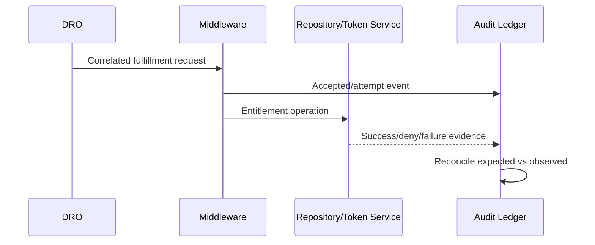

## Purpose

Separate Salesforce fulfillment status from project-owned proof that an external entitlement or download completed. DRO runtime objects remain authoritative for platform state; the audit ledger records cross-system outcomes.

## When to use this doc (agent trigger conditions)

- “Trace an order to a download.”
- “Reconcile DRO and middleware.”
- “Define audit events or negative events.”

## Key concepts

- **Correlation ID:** stable trace key generated at the boundary.
- **Idempotency key:** stable command identity.
- **Positive/negative/compensation event:** outcome classes.
- **Reconciliation:** compare expected and observed state without overwriting evidence.

## Data model & objects

Salesforce-side evidence can reference `FulfillmentPlan`, `FulfillmentStep`, `FulfillmentStepSource`, `FulfillmentLineSourceRel`, and `FulfillmentTransaction` where available. The audit ledger is project-owned and is not a Salesforce DRO object.

## Flow / sequence

## APIs & extension points

Use documented DRO callout providers or an approved integration action. Test platform-event logic with Salesforce’s platform-event Apex test pattern ([developer guide](https://developer.salesforce.com/docs/atlas.en-us/platform_events.meta/platform_events/platform_event_apex_tests.htm)).

> **Unverified:** The event schema, storage technology, retention period, and “download receipt” semantics are project architecture decisions, not Salesforce features.

## Configuration & metadata

Version event schemas. Require `eventId`, `eventType`, `occurredAt`, `correlationId`, `idempotencyKey`, Salesforce record references, actor/service identity, outcome, and payload hash. Store sensitive payloads separately or redact them.

## Agent playbook

1. Start from an order/plan/step/correlation ID.
2. Query Salesforce state read-only.
3. Fetch audit events and sort by event time plus sequence.
4. Detect missing, duplicated, out-of-order, and contradictory outcomes.
5. Produce reconciliation findings; never delete historical events.
6. Propose repair commands with approval and idempotency.

## Guardrails & anti-patterns

- Do not invent field API names, status values, permission-set names, or endpoints.
- Do not write directly to production from an agent session. Generate a diff, validate in a sandbox, and require human approval.
- Do not bypass sharing, CRUD, or field-level security in Apex wrappers.
- Do not treat a UI label as an API name. Confirm with object describe, retrieved metadata, or the target-org schema.
- Do not mark downstream fulfillment successful merely because an asynchronous message was accepted.
- Never log bearer tokens, secrets, or full credentials.
- Never overwrite a failed event with a success; append a correcting event.
- Never claim HTTP acceptance proves customer consumption.

## Verification & tests

1. Contract-test every producer.
2. Replay duplicate and out-of-order events.
3. Test missing-success timeout and late-arrival reconciliation.
4. Confirm immutable append behavior.
5. Verify sensitive-field redaction and access controls.

## References

- [Dynamic Revenue Orchestrator Standard Objects](https://developer.salesforce.com/docs/atlas.en-us.revenue_lifecycle_management_dev_guide.meta/revenue_lifecycle_management_dev_guide/dynamic_revenue_orchestrator_std_objects_parent.htm)
- [Callout Fulfillment Step](https://help.salesforce.com/s/articleView?id=ind.dro_callout.htm&language=en_US&type=5)
- [Testing Platform Events in Apex](https://developer.salesforce.com/docs/atlas.en-us/platform_events.meta/platform_events/platform_event_apex_tests.htm)

**Retrieval keywords:** audit ledger, correlation ID, idempotency key, reconciliation, negative event, compensation, download receipt
