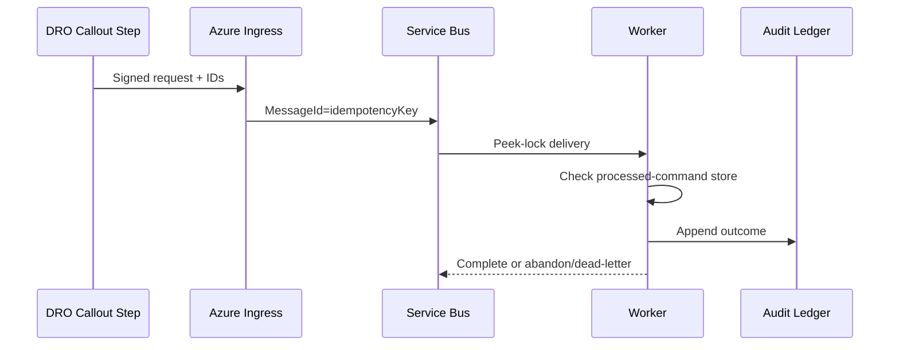

## Purpose

Define a project integration pattern, not a native Salesforce Azure connector. Salesforce callout steps communicate with external systems; Azure services handle project-owned delivery and processing.

## When to use this doc (agent trigger conditions)

- “Send DRO fulfillment to Azure.”
- “Add retries/dead-letter/idempotency.”
- “Choose Event Grid vs Service Bus.”
- “Store integration credentials.”

## Key concepts

- **Event Grid:** event routing with configurable retry limits and dead-letter destination.
- **Service Bus sessions:** ordered handling for related messages.
- **Duplicate detection:** broker feature keyed by `MessageId` within a configured window.
- **Managed identity:** Azure credential mechanism for service-to-service access.
- **Named Credential:** Salesforce callout endpoint/auth configuration.

## Data model & objects

Salesforce references: runtime `FulfillmentStep`/`FulfillmentPlan` and design-time integration provider references. Azure envelope fields are project-owned: `schemaVersion`, `eventId`, `correlationId`, `idempotencyKey`, `orderId`, `fulfillmentStepId`, `sequence`, and `payloadHash`.

## Flow / sequence

## APIs & extension points

Configure Salesforce callouts with Named Credentials ([Apex guide](https://developer.salesforce.com/docs/atlas.en-us.apexcode.meta/apexcode/apex_callouts_named_credentials.htm)). Event Grid can retry and dead-letter based on configured policy, and duplicates can occur ([Microsoft Learn](https://learn.microsoft.com/en-us/azure/event-grid/delivery-and-retry)). Service Bus sessions provide ordered handling of related messages, while duplicate detection is a separate feature ([Microsoft Learn](https://learn.microsoft.com/en-us/azure/service-bus-messaging/advanced-features-overview)).

## Configuration & metadata

- Salesforce: integration definition/provider, callout step, fallout queue/rule, Named Credential.
- Azure: ingress authentication, Event Grid subscription or Service Bus queue/topic, dead-letter target, session/duplicate-detection settings, Key Vault, managed identity, monitoring.
- Contract: versioned JSON schema and allowed transition table.

## Agent playbook

1. Identify whether the message is a notification or ordered command.
2. Define correlation and idempotency keys before code.
3. Configure Named Credential; never embed endpoint credentials.
4. Enable dead-letter handling and an operational replay command.
5. Persist processed-command state around the external side effect.
6. Emit immutable audit outcomes.
7. Test duplicate, delayed, out-of-order, and poison messages.

## Guardrails & anti-patterns

- Do not invent field API names, status values, permission-set names, or endpoints.
- Do not write directly to production from an agent session. Generate a diff, validate in a sandbox, and require human approval.
- Do not bypass sharing, CRUD, or field-level security in Apex wrappers.
- Do not treat a UI label as an API name. Confirm with object describe, retrieved metadata, or the target-org schema.
- Do not mark downstream fulfillment successful merely because an asynchronous message was accepted.
- Do not claim exactly-once end-to-end delivery.
- Do not use Event Grid when strict per-entitlement ordering is required without an ordering layer.
- Do not auto-replay dead letters without validation.
- Do not store Azure or repository secrets in Apex/config files.

## Verification & tests

1. Salesforce `HttpCalloutMock` tests.
2. Contract tests for all schema versions.
3. Duplicate-delivery test with same idempotency key.
4. Session ordering test for one entitlement.
5. Dead-letter and controlled replay test.
6. Managed-identity denial and secret-rotation test.
7. Salesforce fallout/hold test.

## References

- [Callout Fulfillment Step](https://help.salesforce.com/s/articleView?id=ind.dro_callout.htm&language=en_US&type=5)
- [Callouts in Dynamic Revenue Orchestrator](https://developer.salesforce.com/docs/atlas.en-us.revenue_lifecycle_management_dev_guide.meta/revenue_lifecycle_management_dev_guide/dynamic_revenue_orchestrator_callouts_overview.htm)
- [Named Credentials as Callout Endpoints](https://developer.salesforce.com/docs/atlas.en-us.apexcode.meta/apexcode/apex_callouts_named_credentials.htm)
- [Azure Event Grid Delivery and Retry](https://learn.microsoft.com/en-us/azure/event-grid/delivery-and-retry)
- [Azure Service Bus Advanced Features](https://learn.microsoft.com/en-us/azure/service-bus-messaging/advanced-features-overview)
- [Authenticate to Azure Key Vault](https://learn.microsoft.com/en-us/azure/key-vault/general/authentication)

**Retrieval keywords:** Azure middleware, Event Grid, Service Bus, dead letter, session, duplicate detection, Named Credential, managed identity
