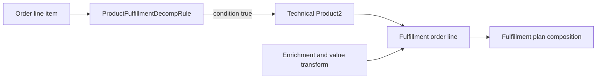

## Purpose

Design and review deterministic decomposition from a commercial `Product2` into the technical products represented by fulfillment lines. Salesforce defines a Decomposition Rule as the rule that selects technical products and Field and Attribute Mapping as the propagation mechanism ([Salesforce Help](https://help.salesforce.com/s/articleView?id=ind.dynamic_revenue_orchestration_essentials.htm&language=en_US&type=5)). Project-specific OCI and entitlement logic remains external policy.

## When to use this doc (agent trigger conditions)

- “Add or change a decomposition rule.”
- “Map a commercial SKU to technical products.”
- “Why did this order create these fulfillment lines?”
- “Compare DRO output with entitlement JSON or OCI labels.”

## Key concepts

- **Commercial product:** sold item used as the decomposition source.
- **Technical product:** downstream-facing product created by decomposition.
- **Decomposition Rule:** selects the destination technical product.
- **Execute on Rule:** gates rule execution.
- **Enrichment rule:** propagates or transforms source data onto fulfillment lines.
- **One-to-one / many-to-one decomposition:** documented decomposition shapes; do not assume one-to-many semantics without testing.

## Data model & objects

All of the objects below are standard SObjects with the full `create()`/`update()`/`upsert()`/`query()` supported-call set, so agents read and write them through the **Data API** (see [Interface Coverage](./interface-coverage.md)).

| API name | Use | Verified relationship / constraint |
|---|---|---|
| `Product2` | Commercial or technical product | `ProductFulfillmentDecompRule.Product2Id` requires an existing product. |
| `ProductFulfillmentDecompRule` | Design-time decomposition rule | Deployment sequence 1 in the decomposition group; lookups: `Ruleset`, `Product2`, `ProductClassification`. Condition data must be written via UPDATE after an empty INSERT. |
| `ProductDecompEnrichmentRule` | Mapping/enrichment child | Parent-child to `ProductFulfillmentDecompRule` via `DecompositionRuleId`. `CalculationMethod` valid values: `Ad-verbatim`, `Static-Lookup`. `RuleEnforcement` (API v63+): `AllFulfillmentRequests`, `InitialFulfillmentRequest`. `SourceType`/`DestinationType`: `Attribute`, `Field`. |
| `ProdtDecompEnrchVarMap` | Expression-variable mapping | Available in API v64.0 and later. |
| `ValTfrm`, `ValTfrmGrp` | Value transformation | Deployment sequence 2–3 alongside decomposition rules. |
| `FulfillmentLineSourceRel` | Runtime provenance | Links `FulfillmentOrderLineItem` to its source. `SupplementalAction` (v62+): `Add`, `Amend`, `Cancel`, `NoChange`. `SourceType`: `SourceBundleRoot`, `SourceLineItem`. |
| `FulfillmentLineAttribute` | Runtime mapped value | Fields: `AttributeDefinitionId`, `AttributeName`, `AttributePicklistValueId`, `AttributeValue`, `ExternalId`, `FulfillmentOrderLineItemId`. |

See [DRO object reference](https://developer.salesforce.com/docs/atlas.en-us.revenue_lifecycle_management_dev_guide.meta/revenue_lifecycle_management_dev_guide/dynamic_revenue_orchestrator_std_objects_parent.htm), [Objects Deployment Reference](https://developer.salesforce.com/docs/atlas.en-us.revenue_lifecycle_management_dev_guide.meta/revenue_lifecycle_management_dev_guide/deployment_dynamic_revenue_orchestrator_objects.htm), and [Additional Deployment Information](https://developer.salesforce.com/docs/atlas.en-us.revenue_lifecycle_management_dev_guide.meta/revenue_lifecycle_management_dev_guide/deployment_dynamic_revenue_orchestrator_additional_info.htm).

## Flow / sequence



1. Resolve products and `AttributeDefinition` records by stable natural keys.
2. Evaluate the execution rule against the sales transaction item.
3. Create the documented fulfillment-line result.
4. Apply enrichment/value transformations.
5. Preserve source lineage for later diagnostics.

## APIs & extension points

Use the documented object APIs only after confirming availability in the target org and API version. Query schema first; do not infer fields from labels.

```bash
sf org display --target-org "$ORG_ALIAS"
sf data query --target-org "$ORG_ALIAS" --query "SELECT Id FROM FulfillmentPlan LIMIT 1" --json
sf apex run test --target-org "$ORG_ALIAS" --test-level RunLocalTests --wait 30 --result-format json
sf project deploy start --target-org "$ORG_ALIAS" --source-dir force-app --dry-run --test-level RunLocalTests
```

`sf project deploy start --dry-run` validates without saving; use `sf project deploy validate` when a validation job and later quick deploy are required ([Salesforce CLI](https://developer.salesforce.com/docs/platform/salesforce-cli-reference/guide/cli_reference_project_deploy_start.html)).

### Data-migration order (verbatim from the [Objects Deployment Reference](https://developer.salesforce.com/docs/atlas.en-us.revenue_lifecycle_management_dev_guide.meta/revenue_lifecycle_management_dev_guide/deployment_dynamic_revenue_orchestrator_objects.htm))

Decomposition family, in order:

1. `ProductFulfillmentDecompRule`
2. `ValTfrmGrp`
3. `ValTfrm`
4. `ProductDecompEnrichmentRule`
5. `ProdtDecompEnrchVarMap`

### Special-field write pattern (verbatim from [Additional Deployment Information](https://developer.salesforce.com/docs/atlas.en-us.revenue_lifecycle_management_dev_guide.meta/revenue_lifecycle_management_dev_guide/deployment_dynamic_revenue_orchestrator_additional_info.htm))

- Rule sets: “Rule set references are created in the target org by using UPDATE operation on the JSON fields as listed in the Special Fields section. Any rule set records and references aren’t created on INSERT operation.”
- Conditions: “You can’t insert a new DRO rule record with condition data. You can only update the record.”
- Enrichment identifiers: “refresh identifier fields by saving the records again, or set the identifier fields to null during migration.”

```bash
# Two-phase decomposition-rule import.
sf data create record --target-org "$ORG_ALIAS" \
  --sobject ProductFulfillmentDecompRule \
  --values "Name='SKU-A Decomp' Product2Id=$P2_ID"
sf data update record --target-org "$ORG_ALIAS" \
  --sobject ProductFulfillmentDecompRule \
  --record-id $NEW_ID \
  --values "ConditionData='<JSON from source org>'"
```

## Configuration & metadata

Use the Product **Decomposition** tab or Product Decomposition Workspace component for supported UI configuration. Before migration, deploy `Product2`, `AttributeDefinition`, and relevant `AttributePicklistValue` records; keep `AttributeCode` consistent across orgs ([Salesforce deployment guidance](https://developer.salesforce.com/docs/atlas.en-us.revenue_lifecycle_management_dev_guide.meta/revenue_lifecycle_management_dev_guide/deployment_dynamic_revenue_orchestrator_additional_info.htm)).

## Agent playbook

1. Retrieve the source and target `Product2` records and confirm stable keys such as `ProductCode`; never join by display name alone.
2. Describe `ProductFulfillmentDecompRule` and query the existing rule graph.
3. Read `ConditionData`, enrichment rules, value transforms, and referenced attributes.
4. Produce a normalized expected-output fixture: source line, destination product, quantity, mapped attributes, and condition reason.
5. Diff the fixture against entitlement JSON and OCI labels; classify project-specific mismatches separately from Salesforce configuration errors.
6. Generate data migration or metadata changes only after confirming the supported interface in the target release.
7. Validate with the [Decomposition Viewer](./decomposition-viewer.md).

## Guardrails & anti-patterns

- Do not invent field API names, status values, permission-set names, or endpoints.
- Do not write directly to production from an agent session. Generate a diff, validate in a sandbox, and require human approval.
- Do not bypass sharing, CRUD, or field-level security in Apex wrappers.
- Do not treat a UI label as an API name. Confirm with object describe, retrieved metadata, or the target-org schema.
- Do not mark downstream fulfillment successful merely because an asynchronous message was accepted.
- Keep conditions shallow; move external lookups out of deterministic rule evaluation.
- Do not embed Nexus paths or proprietary entitlement policy into undocumented Salesforce fields.

## Verification & tests

1. Run static checks and Apex tests.
2. Validate the deployment with `sf project deploy start --dry-run --test-level RunLocalTests`.
3. Submit a synthetic, non-production order and inspect decomposition, fulfillment lines, plan, steps, and fallout.
4. Repeat the request with the same correlation/idempotency key and verify no duplicate external effect.
5. Exercise a negative path and confirm the failure is visible and recoverable.
6. Assert exact technical-product set, quantities, source relationships, and mapped attributes for condition-true and condition-false fixtures.

## References

- [Dynamic Revenue Orchestrator Essentials](https://help.salesforce.com/s/articleView?id=ind.dynamic_revenue_orchestration_essentials.htm&language=en_US&type=5)
- [Define How a Product Decomposes](https://help.salesforce.com/s/articleView?id=ind.dro_define_how_a_product_decomposes.htm&language=en_US&type=5)
- [Define Execution Rules for a Decomposition Rule](https://help.salesforce.com/s/articleView?language=en_US&id=ind.dro_define_conditions_for_a_decomposition_rule.htm&type=5)
- [Define Field and Attribute Mapping](https://help.salesforce.com/s/articleView?id=ind.dro_define_field_and_attribute_mapping.htm&language=en_US&type=5)
- [Dynamic Revenue Orchestrator Standard Objects](https://developer.salesforce.com/docs/atlas.en-us.revenue_lifecycle_management_dev_guide.meta/revenue_lifecycle_management_dev_guide/dynamic_revenue_orchestrator_std_objects_parent.htm)
- [Dynamic Revenue Orchestrator Additional Deployment Information](https://developer.salesforce.com/docs/atlas.en-us.revenue_lifecycle_management_dev_guide.meta/revenue_lifecycle_management_dev_guide/deployment_dynamic_revenue_orchestrator_additional_info.htm)

**Retrieval keywords:** decomposition, commercial product, technical product, ProductFulfillmentDecompRule, enrichment, ConditionData, fulfillment line, attribute mapping
