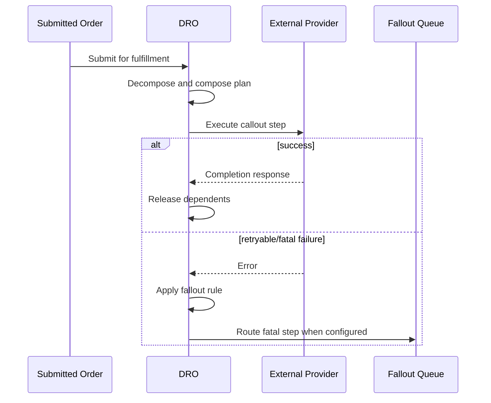

## Purpose

Define an agent-safe method for authoring and reviewing the plan composed after decomposition. Salesforce documents Auto Task, Callout, Manual Task, Milestone, and Pause step types ([Salesforce Help](https://help.salesforce.com/s/articleView?language=en_US&id=sf.dro_fulfillment_step_types.htm&type=5)).

## When to use this doc (agent trigger conditions)

- “Create or review a fulfillment step graph.”
- “Add a callout/manual task/pause/milestone.”
- “Configure retry, fallout, jeopardy, or dependencies.”
- “Explain why a step is on hold or late.”

## Key concepts

- **Fulfillment Scenario:** links product/action context to a step-definition group.
- **Step definition group:** reusable design-time sequence.
- **Step dependency:** ordering constraint.
- **Callout:** external-system communication; asynchronous calls can remain In Progress.
- **Fallout:** failure handling, retries, and queue routing.
- **Jeopardy:** late-risk evaluation from Estimated Duration and Jeopardy Threshold.
- **Point of No Return (PONR):** limits in-flight cancellation/amendment.

## Data model & objects

| API name | Role |
|---|---|
| `FulfillmentStepDefinitionGroup` | Design-time group. |
| `FulfillmentStepDefinition` | Design-time step; can reference an integration provider, flow, user, or queue. |
| `FulfillmentStepDependencyDef` | Design-time dependency. |
| `ProductFulfillmentScenario` | Product-to-group selection. |
| `FulfillmentPlan` | Runtime plan. |
| `FulfillmentStep` | Runtime task. |
| `FulfillmentStepDependency` | Runtime dependency. |
| `FulfillmentStepSource` | Runtime link to order lines. |
| `FulfillmentFalloutRule` | Failure policy. |
| `FulfillmentStepJeopardyRule` | Duration/tolerance rule. |

The exact API names are in the [DRO object reference](https://developer.salesforce.com/docs/atlas.en-us.revenue_lifecycle_management_dev_guide.meta/revenue_lifecycle_management_dev_guide/dynamic_revenue_orchestrator_std_objects_parent.htm).

## Flow / sequence



## APIs & extension points

Use the documented object APIs only after confirming availability in the target org and API version. Query schema first; do not infer fields from labels.

```bash
sf org display --target-org "$ORG_ALIAS"
sf data query --target-org "$ORG_ALIAS" --query "SELECT Id FROM FulfillmentPlan LIMIT 1" --json
sf apex run test --target-org "$ORG_ALIAS" --test-level RunLocalTests --wait 30 --result-format json
sf project deploy start --target-org "$ORG_ALIAS" --source-dir force-app --dry-run --test-level RunLocalTests
```

`sf project deploy start --dry-run` validates without saving; use `sf project deploy validate` when a validation job and later quick deploy are required ([Salesforce CLI](https://developer.salesforce.com/docs/platform/salesforce-cli-reference/guide/cli_reference_project_deploy_start.html)).
DRO callout providers include Standard Fulfillment Provider and External Services Defined Provider. The latter uses an OpenAPI-described external service and requires Omnistudio Admin and Omnistudio Runtime permissions ([developer guide](https://developer.salesforce.com/docs/atlas.en-us.revenue_lifecycle_management_dev_guide.meta/revenue_lifecycle_management_dev_guide/dynamic_revenue_orchestrator_callouts_overview.htm)).

## Configuration & metadata

Create and organize steps and dependencies in fulfillment workspaces. A callout step references an integration definition and a fallout queue; an inactive integration definition can place the callout on hold ([Salesforce Help](https://help.salesforce.com/s/articleView?id=ind.dro_callout.htm&language=en_US&type=5)). Configure Salesforce queues for `FulfillmentStep` and refresh the Fulfillment Fallout Rules decision table after fallout-rule changes ([fallout guidance](https://help.salesforce.com/s/articleView?id=ind.dro_fallout_design_and_management.htm&language=en_US&type=5)).

## Agent playbook

1. Query the scenario, group, step definitions, and dependency definitions.
2. Topologically sort the graph; reject cycles and missing nodes.
3. Resolve each step’s provider/flow/queue references.
4. Classify failure outcomes: retry, queue/fallout, pause/hold, or project-owned compensation.
5. Generate a dry-run graph report before any write.
6. Deploy to a sandbox and submit a synthetic order.
7. Inspect runtime `FulfillmentPlan`, `FulfillmentStep`, dependencies, and sources.

## Guardrails & anti-patterns

- Do not invent field API names, status values, permission-set names, or endpoints.
- Do not write directly to production from an agent session. Generate a diff, validate in a sandbox, and require human approval.
- Do not bypass sharing, CRUD, or field-level security in Apex wrappers.
- Do not treat a UI label as an API name. Confirm with object describe, retrieved metadata, or the target-org schema.
- Do not mark downstream fulfillment successful merely because an asynchronous message was accepted.
- Do not claim that acceptance of an async callout proves downstream completion.
- Do not add custom compensation semantics to DRO unless supported by configured steps and tested plan reconciliation.
- Project preference: keep graphs shallow, but treat “three to five nodes” as guidance, not a Salesforce limit.

## Verification & tests

1. Run static checks and Apex tests.
2. Validate the deployment with `sf project deploy start --dry-run --test-level RunLocalTests`.
3. Submit a synthetic, non-production order and inspect decomposition, fulfillment lines, plan, steps, and fallout.
4. Repeat the request with the same correlation/idempotency key and verify no duplicate external effect.
5. Exercise a negative path and confirm the failure is visible and recoverable.
6. Test dependency ordering, inactive-integration hold, retry exhaustion, fallout queue routing, and jeopardy thresholds.

## References

- [Dynamic Revenue Orchestrator Essentials](https://help.salesforce.com/s/articleView?id=ind.dynamic_revenue_orchestration_essentials.htm&language=en_US&type=5)
- [Design Your Order Orchestration](https://help.salesforce.com/s/articleView?id=ind.dro_design_time_orchestration.htm&language=en_US&type=5)
- [Fulfillment Step Types](https://help.salesforce.com/s/articleView?language=en_US&id=sf.dro_fulfillment_step_types.htm&type=5)
- [Callout Fulfillment Step](https://help.salesforce.com/s/articleView?id=ind.dro_callout.htm&language=en_US&type=5)
- [Callouts in Dynamic Revenue Orchestrator](https://developer.salesforce.com/docs/atlas.en-us.revenue_lifecycle_management_dev_guide.meta/revenue_lifecycle_management_dev_guide/dynamic_revenue_orchestrator_callouts_overview.htm)
- [Dynamic Revenue Orchestrator Standard Objects](https://developer.salesforce.com/docs/atlas.en-us.revenue_lifecycle_management_dev_guide.meta/revenue_lifecycle_management_dev_guide/dynamic_revenue_orchestrator_std_objects_parent.htm)
- [Fallout Design and Management](https://help.salesforce.com/s/articleView?id=ind.dro_fallout_design_and_management.htm&language=en_US&type=5)
- [SLA Jeopardy Administration](https://help.salesforce.com/s/articleView?id=ind.dro_sla_jeopardy_administration.htm&language=en_US&type=5)

**Retrieval keywords:** fulfillment plan, FulfillmentStepDefinition, dependency, scenario, callout, fallout, jeopardy, pause, PONR
