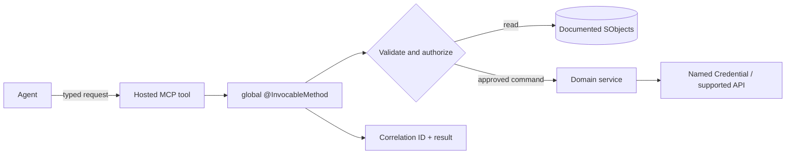

## Purpose

Define the canonical wrapper vocabulary for this set: **read adapter**, **validation action**, **command wrapper**, and **MCP tool**. Hosted MCP custom servers support Apex invocable actions, Flow, and SObject tools and can be deployed with Metadata API ([Salesforce Developers](https://developer.salesforce.com/docs/platform/hosted-mcp-servers/guide/custom-servers.html)).

## When to use this doc (agent trigger conditions)

- “Expose DRO validation to MCP.”
- “Create an invocable action around an approved service.”
- “Replace a UI-only repeatable check with a governed interface.”
- “Review wrapper security or idempotency.”

## Key concepts

- **Read adapter:** queries documented runtime objects and returns normalized JSON.
- **Validation action:** performs no mutation; compares actual and expected state.
- **Command wrapper:** performs one documented operation with authorization, dry-run, idempotency, and audit.
- **MCP tool:** typed exposure of a backing Apex invocable action, Flow, or SObject tool.
- **Thin facade:** coordinates supported APIs; never clones DRO decomposition logic.

## Data model & objects

Every DRO design-time and runtime entity in the Revenue Cloud Advanced schema is a **standard SObject**. The [Revenue Management developer guide](https://developer.salesforce.com/docs/atlas.en-us.revenue_lifecycle_management_dev_guide.meta/revenue_lifecycle_management_dev_guide/dynamic_revenue_orchestrator_std_objects_parent.htm) lists `create()`, `update()`, `upsert()`, `query()`, `retrieve()`, `delete()`, and `undelete()` as supported calls on every object below. Wrappers therefore target the **standard Data API** (REST `/services/data/vXX.X/sobjects/...`, SOAP, or Apex DML). They do not target the Tooling API and they do not target the Metadata API for record data.

| Concern | Design-time objects | Runtime objects |
|---|---|---|
| Decomposition | `ProductFulfillmentDecompRule`, `ProductDecompEnrichmentRule`, `ProdtDecompEnrchVarMap`, `ValTfrmGrp`, `ValTfrm` | `FulfillmentLineSourceRel`, `FulfillmentLineAttribute`, `FulfillmentLineRel` |
| Orchestration | `FulfillmentStepDefinitionGroup`, `FulfillmentStepDefinition`, `FulfillmentStepDependencyDef`, `ProductFulfillmentScenario`, `FulfillmentWorkspace`, `FulfillmentWorkspaceItem` | `FulfillmentPlan`, `FulfillmentStep`, `FulfillmentStepDependency`, `FulfillmentStepSource` |
| Fallout & SLA | `FulfillmentFalloutRule`, `FulfillmentStepJeopardyRule`, `FulfillmentTaskAssignmentRule` | — |
| Assets | — | `FulfillmentAsset`, `FulfillmentAssetAttribute`, `FulfillmentAssetRelationship`, `AssetFulfillmentDecomp` |

Only the Setup surface itself (Feature Settings → Dynamic Revenue Orchestrator flags, Context Definition Settings, Fulfillment User selection) is expressed as [DRO metadata types](https://developer.salesforce.com/docs/atlas.en-us.revenue_lifecycle_management_dev_guide.meta/revenue_lifecycle_management_dev_guide/deployment_dynamic_revenue_orchestrator_metadata.htm) deployed via Metadata API. Everything a wrapper reads or writes at record level is Data API.

## Flow / sequence



## APIs & extension points

A Hosted MCP Apex backing action requires a `global` method annotated with `@InvocableMethod`; when the underlying signature changes, update the tool configuration in Setup ([Salesforce Developers](https://developer.salesforce.com/docs/platform/hosted-mcp-servers/guide/invocable-actions.html)).

```apex
global with sharing class DroReadAdapterAction {
    global class Request {
        @InvocableVariable(required=true) global Id orderId;
    }
    global class Result {
        @InvocableVariable global String correlationId;
        @InvocableVariable global String payloadJson;
    }
    @InvocableMethod(label='Read DRO Decomposition')
    global static List<Result> read(List<Request> requests) {
        // Delegate to a tested service. Query only described fields.
        return DroReadAdapterService.read(requests);
    }
}
```

Use Named Credentials for Apex callout endpoints rather than embedding URLs or credentials ([Apex guide](https://developer.salesforce.com/docs/atlas.en-us.apexcode.meta/apexcode/apex_callouts_named_credentials.htm)). Never use `UserInfo.getSessionId()` as a bearer token.

### Design-time write pattern (data-migration wrapper)

When a coding agent must move design-time configuration between orgs, follow the [Additional Deployment Information for DRO](https://developer.salesforce.com/docs/atlas.en-us.revenue_lifecycle_management_dev_guide.meta/revenue_lifecycle_management_dev_guide/deployment_dynamic_revenue_orchestrator_additional_info.htm) rules. Two must be baked into any wrapper:

1. **Rule-set references need INSERT + UPDATE.** From the guide: “Rule set references are created in the target org by using UPDATE operation on the JSON fields as listed in the Special Fields section. Any rule set records and references aren’t created on INSERT operation.”
2. **Conditions need INSERT + UPDATE.** “You can’t insert a new DRO rule record with condition data. You can only update the record.” The wrapper must first `create()` the row with an empty condition, then `update()` the condition JSON from the source org.

```apex
// Sketch of a two-phase write for a decomposition rule.
ProductFulfillmentDecompRule r = new ProductFulfillmentDecompRule(
    Name = src.Name,
    Product2Id = src.Product2Id
    // NOTE: leave condition/rule-set JSON fields empty here.
);
insert r;

ProductFulfillmentDecompRule patch = new ProductFulfillmentDecompRule(
    Id = r.Id,
    // Populate the Special-Fields JSON payload copied from the source org here.
    RuleSetJson__field = src.RuleSetJson__field,
    ConditionJson__field = src.ConditionJson__field
);
update patch;
```

Enrichment identifier fields (`ProductDecompEnrichmentRule`) must be either re-saved after migration or nulled during migration, per the same page. Wrap this normalization inside the service so agent-generated diffs stay deterministic.

## Configuration & metadata

1. Configure the Apex class/Flow in Salesforce Setup as a custom MCP tool.
2. Apply least-privilege permission sets that exist in the target org.
3. Store endpoints and authentication in Named Credentials/External Credentials.
4. Deploy the custom server via Metadata API.
5. Version the input/output schema and payload hash.

## Agent playbook

1. Prove the gap with [Interface Coverage](./interface-coverage.md).
2. Prefer a read adapter or validation action over a mutation.
3. Describe objects and retrieve existing metadata/configuration.
4. Generate Apex `with sharing`, explicit DTOs, bulk-safe loops, and dependency-injected services.
5. Add authorization, idempotency, dry-run, correlation ID, and structured errors.
6. Use `HttpCalloutMock` for callouts and negative tests.
7. Validate deployment, then register the tested invocable action as an MCP tool.
8. Keep production activation behind human review.

## Guardrails & anti-patterns

- Do not invent field API names, status values, permission-set names, or endpoints.
- Do not write directly to production from an agent session. Generate a diff, validate in a sandbox, and require human approval.
- Do not bypass sharing, CRUD, or field-level security in Apex wrappers.
- Do not treat a UI label as an API name. Confirm with object describe, retrieved metadata, or the target-org schema.
- Do not mark downstream fulfillment successful merely because an asynchronous message was accepted.
- Never use session IDs as bearer tokens in generated code.
- Never make callouts from triggers; queue supported asynchronous work when transaction boundaries require it.
- Never invent a “run decomposition” Apex service to mimic the platform.
- Avoid UI-driving in production agent paths.

## Verification & tests

1. Unit-test DTO validation, sharing behavior, idempotency, and error mapping.
2. Use `HttpCalloutMock` for every external response class.
3. Assert bulk behavior with multiple requests in one invocable call.
4. Run `sf apex run test --test-level RunLocalTests --result-format json --wait 30`.
5. Run a dry-run metadata deployment.
6. Invoke the MCP tool as a least-privilege user and verify denied operations remain denied.
7. Re-run the same request and prove no duplicate mutation.

## References

- [Build Custom MCP Servers](https://developer.salesforce.com/docs/platform/hosted-mcp-servers/guide/custom-servers.html)
- [Hosted MCP Invocable Actions](https://developer.salesforce.com/docs/platform/hosted-mcp-servers/guide/invocable-actions.html)
- [Dynamic Revenue Orchestrator Standard Objects](https://developer.salesforce.com/docs/atlas.en-us.revenue_lifecycle_management_dev_guide.meta/revenue_lifecycle_management_dev_guide/dynamic_revenue_orchestrator_std_objects_parent.htm)
- [Dynamic Revenue Orchestrator Objects Deployment Reference](https://developer.salesforce.com/docs/atlas.en-us.revenue_lifecycle_management_dev_guide.meta/revenue_lifecycle_management_dev_guide/deployment_dynamic_revenue_orchestrator_objects.htm)
- [Dynamic Revenue Orchestrator Additional Deployment Information](https://developer.salesforce.com/docs/atlas.en-us.revenue_lifecycle_management_dev_guide.meta/revenue_lifecycle_management_dev_guide/deployment_dynamic_revenue_orchestrator_additional_info.htm)
- [Dynamic Revenue Orchestrator Metadata Deployment Reference](https://developer.salesforce.com/docs/atlas.en-us.revenue_lifecycle_management_dev_guide.meta/revenue_lifecycle_management_dev_guide/deployment_dynamic_revenue_orchestrator_metadata.htm)
- [Assign Agentforce Revenue Management Permission Sets](https://help.salesforce.com/s/articleView?id=ind.revenue_cloud_permission_sets_table.htm&language=en_US&type=5)
- [Named Credentials as Callout Endpoints](https://developer.salesforce.com/docs/atlas.en-us.apexcode.meta/apexcode/apex_callouts_named_credentials.htm)
- [Salesforce CLI project deploy start](https://developer.salesforce.com/docs/platform/salesforce-cli-reference/guide/cli_reference_project_deploy_start.html)

**Retrieval keywords:** wrapper, global InvocableMethod, Hosted MCP, read adapter, validation action, Named Credential, idempotency, thin facade
